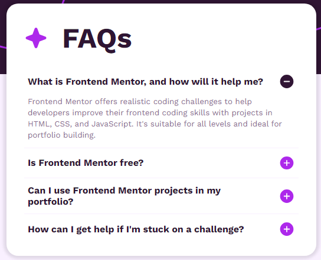

# Frontend Mentor - FAQ accordion solution

This is a solution to the [FAQ accordion challenge on Frontend Mentor](https://www.frontendmentor.io/challenges/faq-accordion-wyfFdeBwBz). Frontend Mentor challenges help you improve your coding skills by building realistic projects.

## Table of contents

- [Overview](#overview)
  - [The challenge](#the-challenge)
  - [Screenshot](#screenshot)
  - [Links](#links)
- [My process](#my-process)
  - [Built with](#built-with)
  - [What I learned](#what-i-learned)
- [Author](#author)

**Note: Delete this note and update the table of contents based on what sections you keep.**

## Overview

### The challenge

Users should be able to:

- Hide/Show the answer to a question when the question is clicked
- Navigate the questions and hide/show answers using keyboard navigation alone
- View the optimal layout for the interface depending on their device's screen size
- See hover and focus states for all interactive elements on the page

### Screenshot

### Links

- Github URL: [Github URL](https://github.com/exchyphen/fm_faq-accordian)
- Live Site URL: [live site hosted by Github Pages](https://exchyphen.github.io/fm_faq-accordian/)

## My process

### Built with

- HTML
- CSS
- JavaScript
- React

### What I learned

Allow for keyboard navigation by wrapping or changing activatable div elements to "clickable" elements such as button, a, etc.

## Author

- Github - [exchyphen](https://github.com/exchyphen)
- Frontend Mentor - [@exchyphen](https://www.frontendmentor.io/profile/exchyphen)
